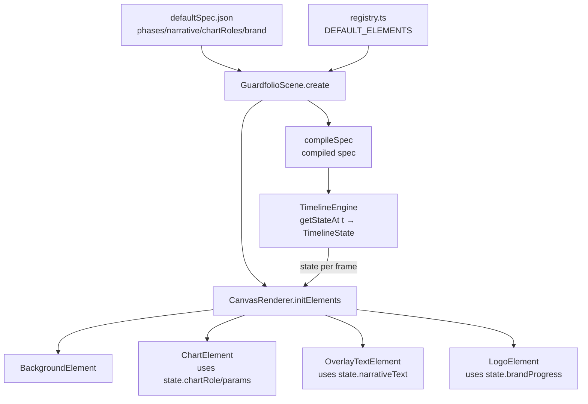
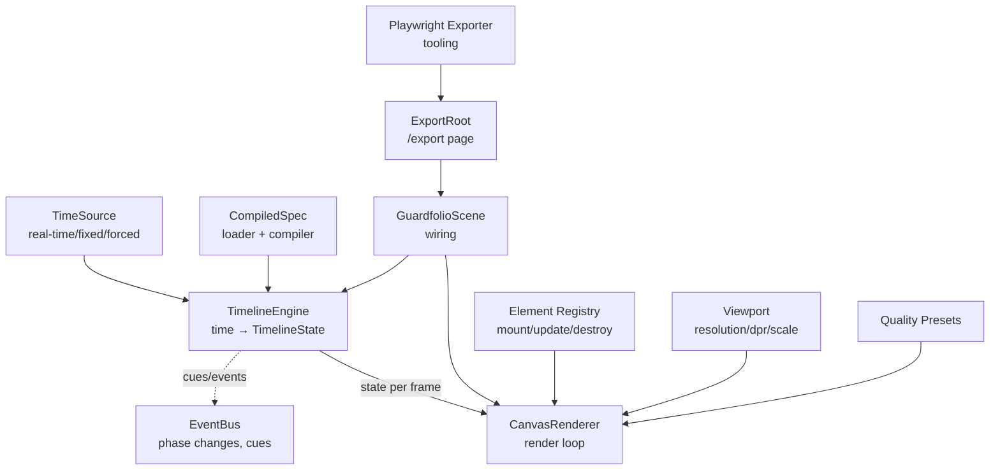

# Архитектура движка

## Цель

Документация архитектуры движка превращает обзор в практический процесс эксплуатации. Документ включает визуализацию слоёв, правила каждого уровня, три критических раздела (Golden Paths, Invariants, Composition), а также текущее состояние реализации.

## Архитектурные слои

### 1. Core (engine/) - Детерминизм и данные

**Принцип**: Чистая функция времени → состояние. Не знает про Pixi, DOM, экспорт.

**Компоненты**:
- `timelineEngine.ts` - чистая функция `getStateAt(t)` → `TimelineState`
- `timeSource.ts` - источник времени (real-time / forced, есть возможность добавить fixed-step)
- `spec/` - loader + compiler + schema для описания анимации
- `eventBus.ts` - события (phase changes, cues, beam events)

**Текущее состояние**: ✅ Полностью реализовано

**Файлы**:
- `src/engine/timelineEngine.ts` - основной движок
- `src/engine/timeSource.ts` - источник времени
- `src/engine/fixedStepTimeSource.ts` - fixed-step для экспорта
- `src/engine/spec/` - система spec (loader, compiler, types, defaultSpec.json)
- `src/engine/eventBus.ts` - система событий
- `src/engine/timelineSpec.ts` - типы состояния

### 2. Render (renderer/) - Пиксели

**Принцип**: Получает только `TimelineState` и рисует. Никаких таймингов внутри элементов.

**Компоненты**:
- `CanvasRenderer.ts` - один canvas, один render loop
- `elements/` - элементы как модули (mount/update/destroy)
- `layers/` - система слоёв (legacy, постепенно мигрирует на elements)
- `viewport.ts` - resolution/dpr/scale
- `quality.ts` - quality presets

**Текущее состояние**: ✅ Полностью реализовано, есть миграция layers → elements

**Файлы**:
- `src/renderer/CanvasRenderer.ts` - основной рендерер
- `src/renderer/elements/` - модульные элементы (Background, Chart, OverlayText, Logo)
- `src/renderer/layers/` - слои (legacy: BackgroundLayer, ChartLayer, UILayer, OverlayLayer, LogoLayer)
- `src/renderer/viewport.ts` - управление viewport
- `src/renderer/quality.ts` - quality presets

### 3. Scene (scenes/) - Wiring

**Принцип**: Решает "что подключать" и "какие параметры", но не рисует и не считает время.

**Компоненты**:
- `GuardfolioScene.ts` - конкретная сцена
- `registry.ts` - registry элементов (состав сцены: какие элементы, их z-index, параметры)
- `spec.ts` - mapping spec → элементы (какие элементы активны в фазах)

**Текущее состояние**: ✅ Основная структура есть, можно улучшить mapping spec → элементы

**Файлы**:
- `src/scenes/guardfolio/GuardfolioScene.ts` - реализация сцены
- `src/scenes/guardfolio/spec.ts` - конфигурация сцены
- `src/scenes/guardfolio/assets.ts` - ассеты сцены
- `src/scenes/guardfolio/registry.ts` - registry элементов и DEFAULT_ELEMENTS (цель: перенести из `src/elements/registry.ts`)

### 4. Tooling (scripts/ или tooling/) - Операционка

**Принцип**: Не лезет внутрь engine/renderer, только через публичный API.

**Компоненты**:
- `/export` режим - режим экспорта (уже есть)
- `render-guardfolio.playwright.ts` - Playwright exporter (есть)
- smoke export - быстрая проверка экспорта
- presets - предустановленные конфигурации качества
- assets preloader - предзагрузка ассетов
- gallery - визуальная инспекция элементов/сцены (не экспорт)

**Текущее состояние**: ⚠️ Частично реализовано (Playwright exporter есть, остальное нужно)

**Файлы**:
- `scripts/render-guardfolio.playwright.ts` - Playwright exporter
- `src/app/ExportRoot.tsx` - экспорт режим (публикует `window.__EXPORT__` API)

## Golden Paths - Как этим пользоваться

### 1. Dev Preview

**Команда**: `pnpm dev`

**Что происходит**:
- Запускается dev server на `http://localhost:5173`
- Открывается главная страница (`/`) в интерактивном режиме
- Показывается `DebugHUD` с информацией и hotkeys

**Hotkeys** (в DebugHUD):
- `Space` - pause/resume
- `←` / `→` - seek ±100ms
- `Shift + ←` / `Shift + →` - seek ±1000ms
- `.` (Period) - step frame (+17ms)

**Использование**: Для разработки, отладки, проверки анимации в реальном времени.

### 2. Export Video

**Команды**:
```bash
# Запуск dev server (или preview)
pnpm dev  # или pnpm preview

# Экспорт видео через Playwright
pnpm export:guardfolio -- --w 1920 --h 1080 --fps 30 --duration 30000 --preset high
```

**Параметры экспорта**:
- `--w` - ширина (default: 1920)
- `--h` - высота (default: 1080)
- `--fps` - FPS (default: 30)
- `--duration` - длительность в ms (default: 30000)
- `--preset` - качество: low/medium/high/ultra (default: high)

**Где лежит файл**: `renders/guardfolio_<timestamp>.webm` (timestamp в миллисекундах)

**Как проверить**: Открыть файл `.webm` в видео плеере

**Использование**: Для финального рендера видео, автоматизации экспорта.

### 3. Spec Editing

**Где defaultSpec.json**: `src/engine/spec/defaultSpec.json`

**Как подложить другой spec через URL/query**:
- Текущая реализация: `loadSpec()` в `src/engine/spec/loader.ts` принимает опциональный `url` параметр
- По умолчанию используется встроенный `DEFAULT_SPEC`
- Для загрузки внешнего spec нужно модифицировать `GuardfolioScene` чтобы передавать URL из query параметров

**Как быстро проверить через /export?duration=2000**:
- Открыть `http://localhost:5173/export?duration=2000`
- Сцена запустится в режиме экспорта с длительностью 2 секунды
- Можно использовать для быстрой проверки изменений spec без полного рендера

**Использование**: Для итеративной работы над анимацией, тестирования разных вариантов spec.

## Invariants - Что нельзя нарушать

### Строгие правила архитектуры

1. **Engine не импортит renderer/app/scripts**
   - `src/engine/` не должен импортировать ничего из `src/renderer/`, `src/app/`, `scripts/`
   - Engine работает только с чистыми данными и типами

2. **Renderer/Elements не импортят engine/spec напрямую**
   - `src/renderer/` и `src/elements/` могут импортировать только типы из `src/engine/timelineSpec.ts`
   - НЕ должны импортировать `timelineEngine.ts`, `spec/compiler.ts` и т.д.
   - Получают данные через `TimelineState` в методе `update()`

3. **Scene — единственное место wiring**
   - Только `src/scenes/` может импортировать и `engine/` и `renderer/`
   - Собирает всё вместе: создаёт engine, renderer, подключает их
   - Registry элементов живёт в `src/scenes/<scene>/registry.ts`, не в `src/renderer/`

4. **Tooling общается только через /export API**
   - `scripts/` не должны импортировать внутренние модули
   - Используют только `window.__EXPORT__` API в режиме `/export`
   - Или публичный API Scene (если создают сцену программно)

5. **В export mode запрещён HUD/DOM overlay**
   - `/export` режим должен быть чистым (только canvas)
   - `DebugHUD` показывается только на главной странице (`/`)
   - Это гарантирует чистый экспорт без артефактов UI

6. **Границы папок — строгие правила импортов**
   - `src/app/` может импортировать `src/scenes/`, но НЕ `src/engine/` и НЕ `src/renderer/` напрямую
   - `scripts/` вообще ничего не импортируют из `src/` (кроме запуска URL через Playwright)
   - Это прямой антидот к будущей деградации архитектуры

### Проверка инвариантов

Можно автоматизировать через ESLint правила или скрипт проверки импортов.

## Public API Contracts

Движок предоставляет публичные интерфейсы для внешнего взаимодействия. Tooling использует только эти API, не лезет внутрь реализации.

### window.__EXPORT__ API

Доступен в режиме `/export` через `ExportRoot`:

```typescript
interface ExportAPI {
  ready: boolean;           // Готовность к экспорту
  seek(ms: number): void;   // Перемещение на время
  getState(): TimelineState; // Получение текущего состояния
  done: Promise<void>;      // Promise завершения экспорта
}
```

**Использование**: Playwright exporter, smoke tests, любые инструменты экспорта.

### Scene API

Публичный интерфейс сцены (через `src/scenes/guardfolio/index.ts`):

```typescript
interface Scene {
  start(): void;                    // Запуск сцены
  stop(): void;                     // Остановка сцены
  seek(t: number): void;            // Перемещение на время
  getCanvas(): HTMLCanvasElement;   // Canvas для записи
  getState(): TimelineState;        // Текущее состояние
  isReady(): boolean;               // Готовность
  isRunning(): boolean;             // Запущена ли сцена
  getMode(): SceneMode;             // Режим работы
  getQuality(): QualityPreset;      // Quality preset
  destroy(): void;                  // Уничтожение сцены
}
```

**Использование**: Программное создание сцены, тестирование, встраивание в другие приложения.

### Query Parameters для /export

Поддерживаемые query параметры для `/export` режима:

- `w` - ширина (number, default: 1920)
- `h` - высота (number, default: 1080)
- `fps` - FPS (number, default: 30)
- `duration` - длительность в ms (number, default: 30000)
- `preset` - quality preset: `low` | `medium` | `high` | `ultra` (default: `high`)
- `spec` - URL к spec JSON файлу (будущее, пока не реализовано)

**Пример**: `/export?w=1920&h=1080&fps=30&duration=2000&preset=high`

**Использование**: Быстрая проверка экспорта, кастомные настройки, автоматизация.

## Composition - Scene Composition Layer

**Точка сборки**: `src/scenes/guardfolio/GuardfolioScene.ts` + `src/scenes/guardfolio/registry.ts`

### Таблица элементов сцены

| Элемент | Тип | Z-Index | Всегда/Опционально | Параметры из spec | Параметры из presets |
|---------|-----|---------|-------------------|-------------------|---------------------|
| Background | `background` | 0 | Всегда | - | Colors, quality |
| Chart | `chart` | 1 | Всегда | `chartRoles`, `macroPhase` | Quality (resolution) |
| OverlayText | `overlay-text` | 20 | Всегда | `narrativeWindows` (text, start, end) | Typography, colors |
| Logo | `logo` | 30 | Всегда | `brand` (start, duration), `brandText` | Typography, colors |
| UI (Header/Progress/Tasks) | `ui` (через layers) | 10 | Опционально* | `dynamicHeaders`, `tasks`, `taskProgress`, `beamSchedule` | Typography, colors |

\* *UI пока реализован через `UILayer` (legacy), будет мигрирован в элементы*

### Mapping spec → элементы

**Текущая реализация** (`src/scenes/guardfolio/registry.ts` — цель архитектуры, пока файл в `src/elements/registry.ts`):
```typescript
export const DEFAULT_ELEMENTS: ElementConfig[] = [
  { type: 'background', zIndex: 0 },
  { type: 'chart', zIndex: 1 },
  { type: 'overlay-text', zIndex: 20 },
  { type: 'logo', zIndex: 30 },
];
```

**Что берётся из spec** (`src/engine/spec/defaultSpec.json`):
- `narrativeWindows` → OverlayTextElement (text, timing)
- `chartRoles` → ChartElement (opacity, blur, scale по времени)
- `brand` → LogoElement (timing, progress)
- `dynamicHeaders` → UILayer (header text по времени)
- `tasks`, `beamSchedule` → UILayer (список задач, анимация лучей)

**Что берётся из presets** (`src/renderer/quality.ts`):
- Resolution, antialias, DPR → все элементы (через viewport)
- Typography (fontSize, fontFamily) → текстовые элементы
- Colors → все элементы (через стили)

**Диаграмма composition flow**:



**Улучшение (будущее)**: Добавить фазоваю активацию элементов в `GuardfolioScene` - указывать какие элементы активны в каких фазах.

## Визуализация потока данных



## Правила слоёв

### Core (engine/)
- ❌ НЕ знает про Pixi.js
- ❌ НЕ знает про DOM
- ❌ НЕ знает про экспорт
- ✅ Только детерминированные вычисления
- ✅ Чистая функция времени → состояния
- ✅ События через EventBus

### Render (renderer/)
- ✅ Получает только `TimelineState`
- ❌ НЕ содержит таймингов внутри элементов
- ✅ Один canvas, один render loop
- ✅ Элементы как модули (mount/update/destroy)
- ✅ Управление viewport и quality

### Scene (scenes/)
- ✅ Решает "что подключать"
- ✅ Решает "какие параметры"
- ❌ НЕ рисует
- ❌ НЕ считает время
- ✅ Registry элементов
- ✅ Mapping spec → элементы

### Tooling (scripts/ или tooling/)
- ✅ Только через публичный API Scene
- ❌ НЕ лезет внутрь engine/renderer
- ✅ Playwright exporter
- ✅ Export режим
- ⚠️ Нужно добавить: smoke export, presets, assets preloader, gallery

## Структура файлов

### Core (engine/)
- `src/engine/timelineEngine.ts` - основной движок timeline, `getStateAt(t)` → `TimelineState`
- `src/engine/timeSource.ts` - источник времени (real-time с возможностью forced time)
- `src/engine/fixedStepTimeSource.ts` - fixed-step time source для детерминированного экспорта
- `src/engine/spec/loader.ts` - загрузка spec из JSON или URL
- `src/engine/spec/compiler.ts` - компиляция spec в CompiledSpec
- `src/engine/spec/types.ts` - типы для spec системы
- `src/engine/spec/defaultSpec.json` - дефолтный spec сценария
- `src/engine/eventBus.ts` - система событий (phase changes, cues, beam events)
- `src/engine/timelineSpec.ts` - типы `TimelineState` и связанные типы
- `src/engine/assetLoader.ts` - загрузка ассетов
- `src/engine/rng.ts` - детерминированный генератор случайных чисел

### Render (renderer/)
- `src/renderer/CanvasRenderer.ts` - основной рендерер, управляет render loop и элементами/слоями
- `src/renderer/elements/Element.ts` - базовый класс элемента (mount/update/destroy)
- `src/renderer/elements/BackgroundElement.ts` - элемент фона (Pixi реализация)
- `src/renderer/elements/ChartElement.ts` - элемент графика (Pixi реализация)
- `src/renderer/elements/OverlayTextElement.ts` - элемент текстового оверлея (Pixi реализация)
- `src/renderer/elements/LogoElement.ts` - элемент логотипа (Pixi реализация)
- `src/renderer/layers/BaseLayer.ts` - базовый класс слоя
- `src/renderer/layers/BackgroundLayer.ts` - слой фона (legacy)
- `src/renderer/layers/ChartLayer.ts` - слой графика (legacy)
- `src/renderer/layers/UILayer.ts` - слой UI (header, progress, tasks) (legacy)
- `src/renderer/layers/OverlayLayer.ts` - слой оверлея (narrative text, noise, scanlines)
- `src/renderer/layers/LogoLayer.ts` - слой логотипа (legacy)
- `src/renderer/viewport.ts` - управление viewport (resolution, DPR, scale)
- `src/renderer/quality.ts` - quality presets и конфигурация
- `src/renderer/rendererSingleton.ts` - singleton для renderer (legacy, используется в hooks)

### Scene (scenes/)
- `src/scenes/guardfolio/GuardfolioScene.ts` - реализация сцены Guardfolio, wiring engine + renderer
- `src/scenes/guardfolio/spec.ts` - конфигурация сцены Guardfolio
- `src/scenes/guardfolio/assets.ts` - манифест ассетов для сцены
- `src/scenes/guardfolio/index.ts` - экспорт сцены
- `src/scenes/guardfolio/registry.ts` - registry элементов и DEFAULT_ELEMENTS конфигурация (цель архитектуры, пока файл в `src/elements/registry.ts`)

### Tooling (scripts/, app/)
- `scripts/render-guardfolio.playwright.ts` - Playwright exporter для видео
- `src/app/ExportRoot.tsx` - компонент для режима экспорта, публикует `window.__EXPORT__` API
- `src/app/SceneRoot.tsx` - компонент для главной страницы с DebugHUD
- `src/app/DebugHUD.tsx` - компонент отладочной информации и hotkeys
- `src/app/App.tsx` - главный компонент, роутинг между `/` и `/export`

### Hooks
- `src/hooks/useTimelineEngine.ts` - hook для работы с TimelineEngine
- `src/hooks/useCanvasRenderer.ts` - hook для работы с CanvasRenderer
- `src/hooks/useRecorder.ts` - hook для записи видео
- `src/hooks/useCleanRecordingMode.ts` - hook для чистого режима записи
- `src/hooks/useContainerRect.ts` - hook для размеров контейнера

## Текущее состояние реализации

### ✅ Полностью готово
- Core (engine/) - все компоненты реализованы
- Render (renderer/) - CanvasRenderer, elements, layers, viewport, quality
- Scene (scenes/) - GuardfolioScene, registry элементов
- Golden Paths - Dev Preview, Export Video (базовый), Spec Editing (частично)

### ⚠️ Частично готово
- Tooling - есть Playwright exporter и export режим, нужно добавить smoke export, presets, assets preloader, gallery
- Mapping spec → элементы - есть базовая реализация через DEFAULT_ELEMENTS, можно улучшить фазами
- Spec Editing - загрузка через URL не реализована, нужно добавить query параметр `?spec=url`
- Registry элементов - сейчас в `src/elements/registry.ts`, цель архитектуры: перенести в `src/scenes/guardfolio/registry.ts`

### 💡 Возможные улучшения
- Добавить загрузку spec через URL query параметр
- Улучшить mapping spec → элементы (фазовая активация)
- Создать структуру `tooling/` для организации операционных скриптов
- Мигрировать UILayer в элементы (TaskList, Progress, Header)
- Добавить автоматическую проверку инвариантов через ESLint или скрипт
- Создать `docs/WORKFLOW.md` с подробными инструкциями по рабочим процессам
